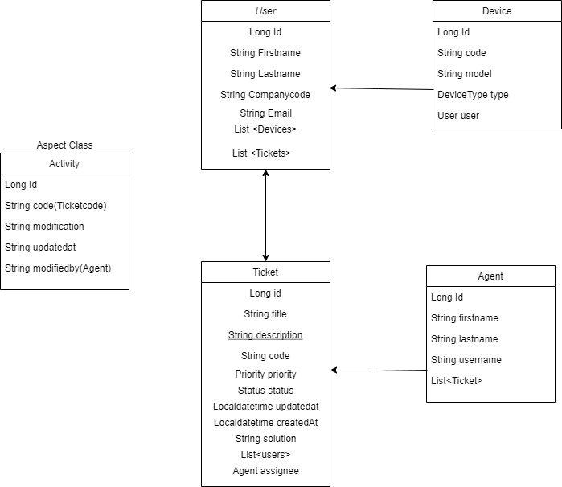

# Ticketing System

### 1. Introduction

The application is an enterprise half-automated tickethandling system. The employees can open requests or incidents which landing on the helpdesk's database.
If the employee exists in the company database, the user is able to create a ticket. The handling of these ticket is manually controlled by the Front Office Agents.
They are able to solve the problem on 1st Level and Close the tickets with a solution and inform the user through email notification.
If the incident or request is to complicated to fulfill, it's possible to escalate the ticket and assign it to a Solution Group. 

### 2. Entities

### 3. Process of tickethandling:

The user is validated by entering a companyNumber and name, then it's possible to make the announcement in the title and description menu.
If the problem affects the user's business devices, there is possible to indicate which device is affected by the problem.

### 4. Importance of Agents:

Tickets are handled by agents. If the problem is resolved at the 1st level, the Agent takes it on its behalf (assignee) and changes it status to resolved.
If the ticket cannot be resolved it has to be escalated. To do this, the category and solution group field has to be filled.

### 5. Monitoring and notification.

Users will be notified by email if the submitted ticket has been sent so they can refer to the ticket number.
After that, they will only be notified when the problem is resolved.
The users can modify the ticket description status to give more detailed description.
Every ticket logged by activities  which indicates, what changes happened since creation. Also indicated which agent or user did the changes in the tickets lifecycle.
It serves well for the agents to understand the ticket status.
Tickets can be filtered by status, priority and type (ticket, request, incident)

### 6. Setup

Required Applications
- JAVA 1.8 enviroment
- Docker app

- Commands to run the app:
/gradlew build -> building of .jar file
- start MySQL container
docker run --ticketingapp --rm -p 3306:3306 -e MYSQL_ROOT_PASSWORD=123 -e MYSQL_DATABASE=ticketingapp -d mysql 
- Start application
java -jar /build/libs/ticketingsystem-0.0.1-SNAPSHOT.jar 

### 7. Technologies

- Git
- Github
- Java
- H2 database
- Spring Data JPA
- Gradle
- RestApi
- Spring boot
- Flyway
- JUnit 5
- Lombok
- Mockito
- Swagger
- Docker
